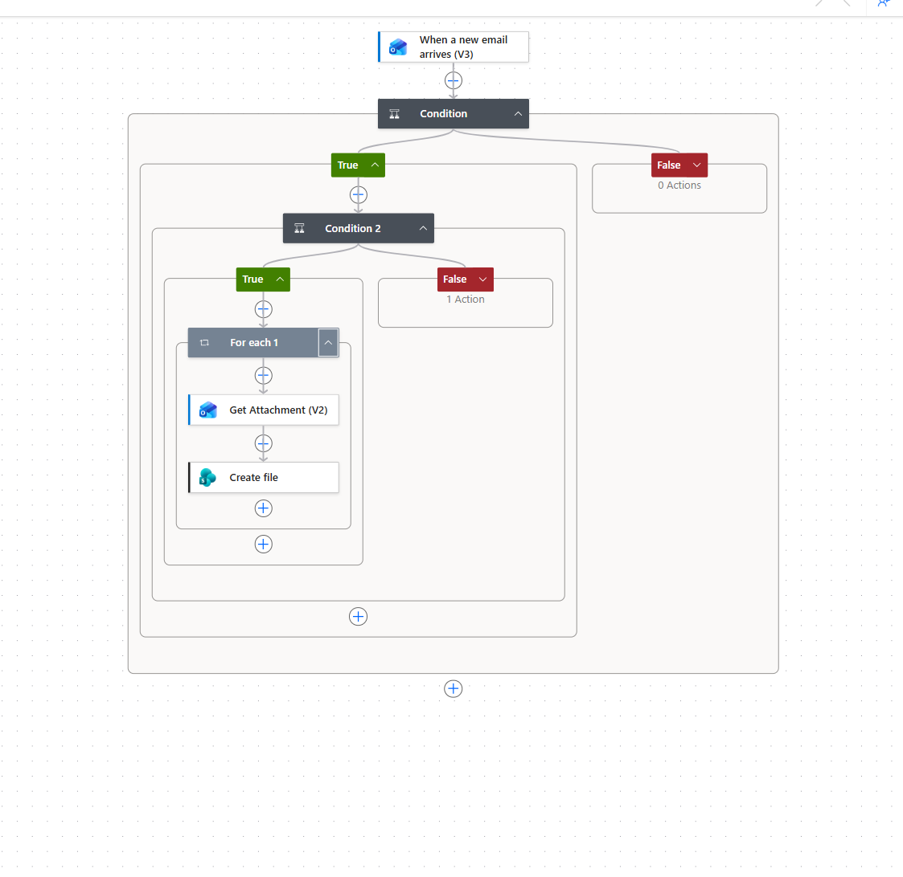
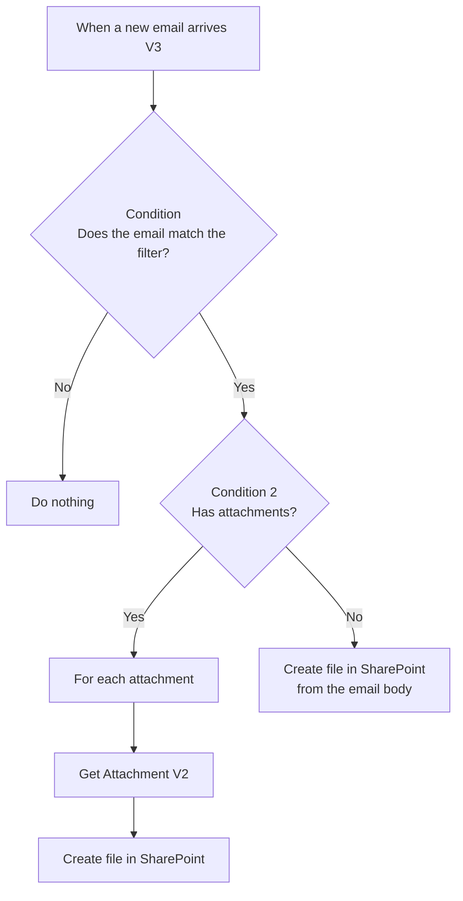

# Email to SharePoint — Power Automate Flow

A Power Automate cloud flow that watches an Outlook mailbox and automatically saves incoming content to a SharePoint document library:

- **Email has attachments** → each attachment is saved to SharePoint as its own file.
- **Email has no attachments** → the email itself is saved to SharePoint (as an `.html` file).



### Example use case

The reference build files weekly status reports into a customer project library:

- Outlook rule moves report emails into a dedicated folder
- Trigger fires only on emails with **Weekly Report** in the subject
- Attachments are saved as `Weekly Report - <attachment name>`
- Emails without attachments are saved as `<Subject>_<date>.html`

## How it works



| Step | Connector | Purpose |
|---|---|---|
| When a new email arrives (V3) | Office 365 Outlook | Trigger on each new message in the chosen folder |
| Condition | Built-in | Only process emails that match your filter (sender, subject, etc.) |
| Condition 2 | Built-in | Branch on whether the email has attachments |
| For each 1 | Built-in | Loop through every attachment on the email |
| Get Attachment (V2) | Office 365 Outlook | Retrieve the attachment content |
| Create file | SharePoint | Write the attachment (or the email) to the document library |

## Prerequisites

- A Microsoft 365 account with a Power Automate license that includes the standard Outlook and SharePoint connectors
- Access to the Outlook mailbox you want to monitor
- Contribute (edit) permission on the target SharePoint site and document library

## Quick start

1. Read [docs/step-by-step.md](docs/step-by-step.md) and build the flow in Power Automate.
2. Copy the expressions from [docs/expressions.md](docs/expressions.md) — they are the part people most often get wrong.
3. Send yourself a test email with and without an attachment, then check the flow run history.
4. If something fails, see [docs/troubleshooting.md](docs/troubleshooting.md).

## Repository structure

```
.
├── README.md                     # This file
├── docs/
│   ├── step-by-step.md           # Full build guide
│   ├── expressions.md            # Every expression used in the flow
│   ├── troubleshooting.md        # Common errors and fixes
│   └── images/
│       └── flow-overview.png     # Screenshot of the finished flow
├── flow/
│   ├── definition-reference.json # Readable reference of the flow's actions
│   └── README.md                 # How to export/import the real flow package
├── CHANGELOG.md
├── LICENSE
└── .gitignore
```

## Customizing

- **Filter logic** — change *Condition* to match sender domain, subject keywords, or importance.
- **Folder per sender or date** — build the SharePoint folder path dynamically (see [expressions.md](docs/expressions.md)).
- **Save the original email as `.eml`** — swap the no-attachment branch to use *Export email (V2)*; see the step-by-step guide.

## Before you publish screenshots or exports

Power Automate screenshots and exported packages often contain your email address, SharePoint tenant URL, site names, and customer or project folder names. Crop or blur those before committing, and use placeholders like `https://YOURTENANT.sharepoint.com/sites/YOURSITE` in docs.

## Contributing

Issues and pull requests are welcome. If you add a variation of the flow, please include a screenshot and update the docs.

## License

[MIT](LICENSE)
